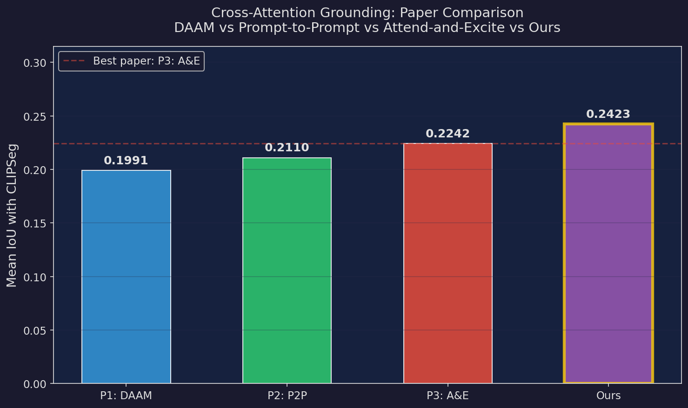
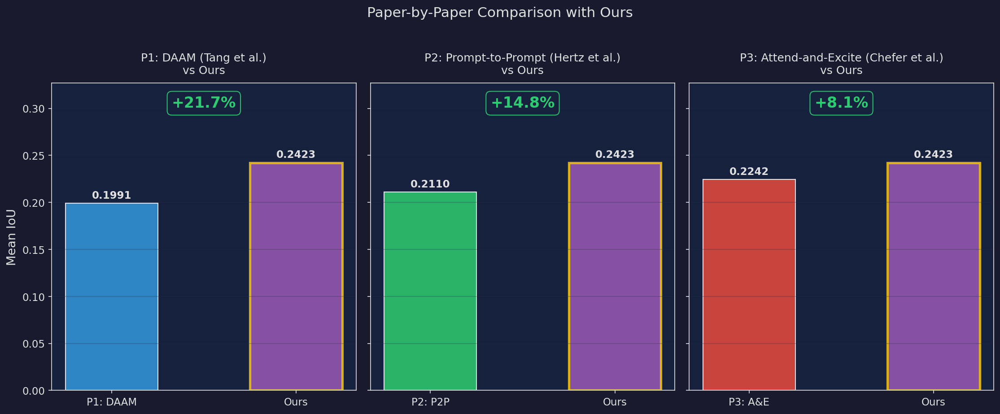
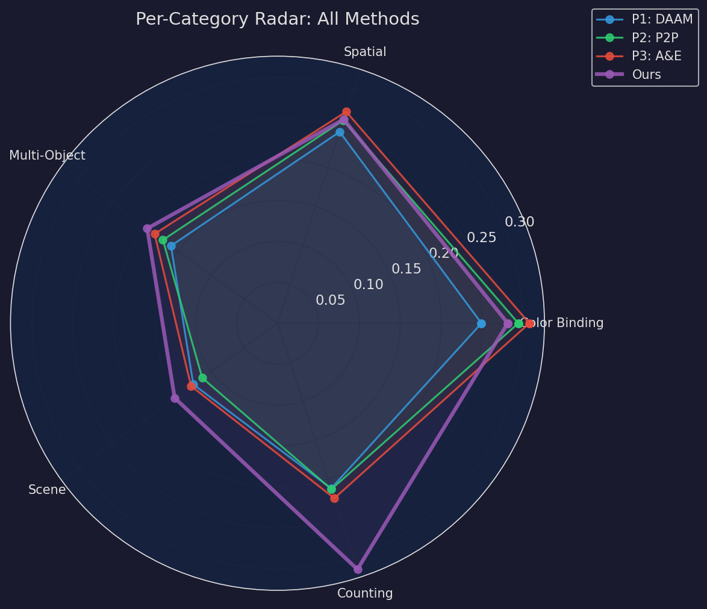
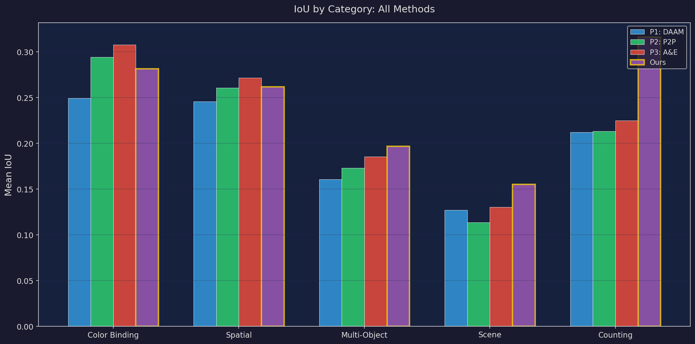

# Cross-Attention Grounding in Stable Diffusion

**Extract cross-attention maps from inside a diffusion model during generation to show which words caused which pixels — then use it to score, re-rank, and benchmark generated images.**

## Results: Paper Comparison (Ablation Study)

We benchmark three published attention aggregation methods against our combined approach across 120 images (15 prompts × 8 seeds), evaluated via IoU against CLIPSeg ground-truth masks.

### Methods

| ID | Paper | Key Technique | Source |
|----|-------|---------------|--------|
| P1 | **DAAM** (Tang et al., ACL 2023) | Bicubic upscale all resolutions → 64×64, clamp≥0, uniform mean | [castorini/daam](https://github.com/castorini/daam) |
| P2 | **Prompt-to-Prompt** (Hertz et al., ICLR 2023) | Late-timestep filtering (last 50%), single res=16 | [google/prompt-to-prompt](https://github.com/google/prompt-to-prompt) |
| P3 | **Attend-and-Excite** (Chefer et al., ICLR 2023) | 2D Gaussian smoothing (σ=0.5, k=3, reflect pad) | [yuval-alaluf/Attend-and-Excite](https://github.com/yuval-alaluf/Attend-and-Excite) |
| **Ours** | Combined | DAAM multi-res + P2P late-step + A&E smoothing + compound phrase eval | — |

### Overall Comparison

| Method | Color Binding | Spatial | Multi-Object | Scene | Counting | **Overall IoU** | vs Ours |
|--------|:------------:|:-------:|:------------:|:-----:|:--------:|:---------------:|:-------:|
| P1: DAAM | 0.2493 | 0.2459 | 0.1609 | 0.1271 | 0.2121 | 0.1991 | +21.7% |
| P2: P2P | 0.2944 | 0.2607 | 0.1731 | 0.1137 | 0.2133 | 0.2110 | +14.8% |
| P3: A&E | 0.3078 | 0.2718 | 0.1857 | 0.1306 | 0.2248 | 0.2242 | +8.1% |
| **Ours** | 0.2814 | 0.2619 | 0.1969 | 0.1553 | **0.3162** | **0.2423** | — |

> **Ours achieves +8.1% over the best individual paper (A&E)**, with the largest gains in Counting (+40.6%) and Scene (+18.9%) categories.

### Plots

<p align="center">
  
</p>

<p align="center">
  
</p>

<p align="center">
  
</p>

<p align="center">
  
</p>

### Key Findings

1. **Compound phrase evaluation is the biggest contributor** — Counting jumps from 0.2248 to 0.3162 because CLIPSeg segments "red apples" far better than "apples" alone.
2. **A&E's Gaussian smoothing is the strongest single technique** — P3 beats both P1 and P2 across all categories.
3. **Scene remains the hardest category** for all methods (0.10–0.15 IoU).

---

## The Core Idea

In Stable Diffusion's UNet, **cross-attention layers** compute attention between image patches (Q) and text tokens (K, V). The attention weight `A[i,j]` tells you how much image patch `i` attended to text token `j`. By aggregating across layers and timesteps, we get a spatial heatmap per token — a soft segmentation map with **zero annotation**.

## Architecture

```
                     Single-Prompt Mode                    Benchmark Mode
                    ┌──────────────────┐               ┌──────────────────┐
                    │generate_and_rank │               │ run_benchmark.py │
                    │       .py        │               │                  │
                    └───────┬──────────┘               └───────┬──────────┘
                            │                                  │
          ┌─────────────────┼──────────────────┐    ┌──────────┼───────────┐
          │                 │                  │    │          │           │
          v                 v                  v    v          v           v
   ┌──────────────┐ ┌──────────────┐ ┌────────────────┐ ┌──────────┐ ┌────────┐
   │  attention_  │ │  heatmap.py  │ │  alignment_    │ │ segment_ │ │analysis│
   │ extractor.py │ │              │ │  scorer.py     │ │ eval.py  │ │  .py   │
   │              │ │ Normalize,   │ │                │ │          │ │        │
   │ Hook UNet    │ │ upscale,     │ │ CLIP + Attn    │ │ CLIPSeg  │ │ Plots, │
   │ cross-attn   │ │ overlay      │ │ scoring        │ │ IoU      │ │ stats  │
   └──────────────┘ └──────────────┘ └────────────────┘ └──────────┘ └────────┘

                    Ablation Mode
                    ┌──────────────────┐
                    │ run_ablation.py  │
                    │                  │
                    │  P1/P2/P3/Ours   │ ← attention_aggregator.py
                    │  comparison      │
                    └──────────────────┘
```

## Components

| File | Role |
|------|------|
| `src/attention_extractor.py` | Hooks UNet cross-attention, stores per-layer per-timestep maps |
| `src/attention_aggregator.py` | Paper-grounded aggregation (DAAM, P2P, A&E) + combined "Ours" |
| `src/heatmap.py` | Normalize, upscale, overlay heatmaps on images |
| `src/alignment_scorer.py` | CLIP + attention alignment scoring for re-ranking |
| `src/segmentation_eval.py` | CLIPSeg IoU evaluation (ground-truth validation) |
| `src/benchmark_prompts.py` | 15 prompts × 5 categories with compound token support |
| `src/analysis.py` | Correlation plots, category breakdowns, best-of-N analysis |

## Setup

```bash
pip install -r requirements.txt
```

> Requires CUDA GPU with 6–8GB VRAM.

## Usage

### Quick Demo (Single Prompt)
```bash
python generate_and_rank.py \
    --prompt "a red bicycle leaning against a brick wall near a flower pot" \
    --n 4 --out results/bicycle/
```

### Full Benchmark (15 prompts × 8 seeds = 120 images)
```bash
python run_benchmark.py --out benchmark_results/ --n 8
python run_benchmark.py --out benchmark_results/ --skip-generation   # resume
python run_benchmark.py --out benchmark_results/ --analysis-only     # plots only
```

### Ablation Study (Paper Comparison)
```bash
python run_ablation.py --benchmark-dir benchmark_results/
python run_ablation.py --benchmark-dir benchmark_results/ --analysis-only
```

## Output Structure

```
benchmark_results/
├── {category}/{slug}/
│   ├── image_*.png, heatmap_*.png, BEST.png
│   ├── token_maps_*.pt, raw_attn_*.pt
│   ├── scores.json, iou_results.json
├── analysis/
│   ├── summary_table.csv
│   ├── correlation_attn_vs_iou.png
│   ├── correlation_clip_vs_combined.png
│   ├── iou_by_category.png, token_iou_distribution.png
│   └── best_of_n_analysis.png
├── ablation/
│   ├── ablation_results.json, comparison_table.csv
│   ├── overall_comparison.png, paper_vs_ours.png
│   ├── category_breakdown.png, radar_chart.png
└── benchmark_report.json
```

## Benchmark Categories

| Category | Focus | Example |
|----------|-------|---------|
| Color Binding | Color-object association | "a blue car next to a red fire hydrant" |
| Spatial | Spatial relationships | "a cat sitting on a wooden table" |
| Multi-Object | Multiple distinct objects | "a laptop, coffee mug, and books on a desk" |
| Scene | Complex scenes | "a lighthouse on a rocky cliff at sunset" |
| Counting | Object counting | "three red apples on a white plate" |

## Project Structure

```
├── generate_and_rank.py        # Single-prompt demo
├── run_benchmark.py            # Full benchmark orchestrator
├── run_ablation.py             # Paper comparison ablation
├── src/
│   ├── attention_extractor.py  # UNet cross-attention hooks
│   ├── attention_aggregator.py # Paper-grounded aggregation strategies
│   ├── heatmap.py              # Visualization utilities
│   ├── alignment_scorer.py     # CLIP + attention scoring
│   ├── segmentation_eval.py    # CLIPSeg IoU evaluation
│   ├── benchmark_prompts.py    # Curated prompt suite
│   └── analysis.py             # Aggregate stats & plots
├── assets/                     # Result plots for README
├── requirements.txt
└── README.md
```

## References

- **DAAM** — Tang et al., *"What the DAAM: Interpreting Stable Diffusion Using Cross Attention"*, ACL 2023
- **Prompt-to-Prompt** — Hertz et al., *"Prompt-to-Prompt Image Editing with Cross Attention Control"*, ICLR 2023
- **Attend-and-Excite** — Chefer et al., *"Attend-and-Excite: Attention-Based Semantic Guidance"*, ICLR 2023
